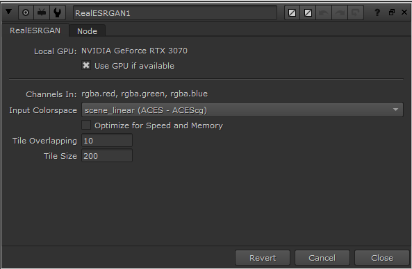

# RealESRGAN upscaling model for Nuke13.1 (and newer versions)
This is a simple project for converting the trained model from https://github.com/xinntao/Real-ESRGAN
into a nuke compatible cat file for inference. Foundry provides their own [model](https://community.foundry.com/cattery/37767/real-esrgan), but it lacks the support
for low-end GPUs. In my tests, I was only able to upscale an 1K image to a 4K image on a GPU with 8GB of 
Vram. The converted model of this project is a little less memory hungry and allows to you to use any input
size for upscaling. This comes of course with one big downside: it's a lot slower than the original implementation.
IMHO it's still worth to give it a shot because with the implementation of this project, you can upscale almost every input 
even on a GTX1070 GPU.

# Using it in Nuke
Just download the `realesrgan_tiled_v2.cat` and `RealESRGAN.gizmo` from the gizmo folder and add it to your `.nuke` folder.
It's that easy. The provided gizmo comes from foundry and is modified to work with the tiling process.

The knobs "Tile Overlapping" and "Tile Size" are added. If you encounter visible edges in your image, 
try increasing the overlapping. To disable any tiling, you can increase the tile size to the input image size.
But keep in mind that this will require a lot of GPU memory.

# Converting the model on your own

Unfortunately I can't manage to set up a `requirements.txt` that can install torch version 1.6.0 on their own.
I already tried to use `--find-links` or `--extra-index-url` in the file but none of them worked.
If you have any idea, please leave a comment :D

## Anyway: how to set up your project:
Run the following two commands after each other:

```
pip install basicsr
pip install torch==1.6.0 torchvision==0.7.0 -f https://download.pytorch.org/whl/torch_stable.html
```
The second command will install the required torch version for nuke 13. 
It will not be completely compatible with `basicsr` but it will be enough to pass
the torchscript conversion.

If you want to use it in nuke 14 only, you can skip the installation of the torch version 1.6.0

# Comparison: Tiled model vs. Original model
The comparison was done on system with a Nvidia GTX 3070 with 8 GB of Vram and an AMD Ryzen 7 5800X 8-Core processor.
For each test a sequence of 10 images was rendered. The input image was scaled to 1K for the first test and scaled to 3K for the second test. 
It's a very small test but possibly provides an insight why this project exists.

| Model        <br/>Processing Unit | 1K Input Image <br/>CPU | <br/>GPU | 3K Input Image<br/>CPU | <br/>GPU      |
|:----------------------------------|:------------------------|:---------|:-----------------------|:--------------|
| Original from Foundry             | 13:08                   | 00:49    | OUT OF RAM             | OUT OF MEMORY |
| Tiled Model (1K Tile Size)        | 13:13                   | 00:59    | OUT OF RAM             | OUT OF MEMORY |
| Tiled Model (200px Tile Size)     | 16:27                   | 01:45    | OUT OF RAM             | 08:05         |

As you can see, the original REALESRGAN is slightly faster than the tiled one. That said, 
there is a significant benefit of the tiled one: it can process larger input images.
In my tests I used some input images up to 8K. They take quite some time but at least they produce an output.
That was my goal with this project.

